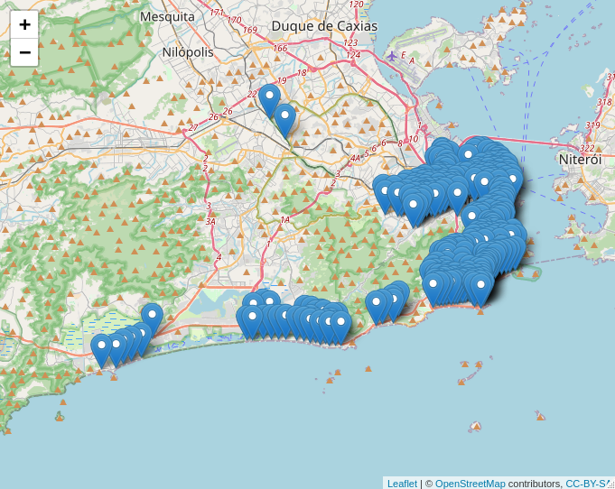
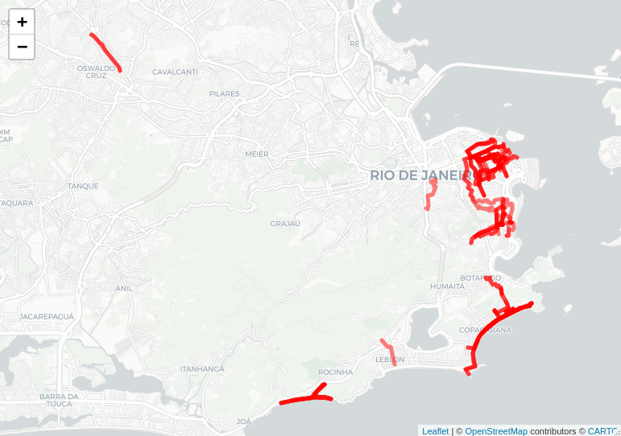
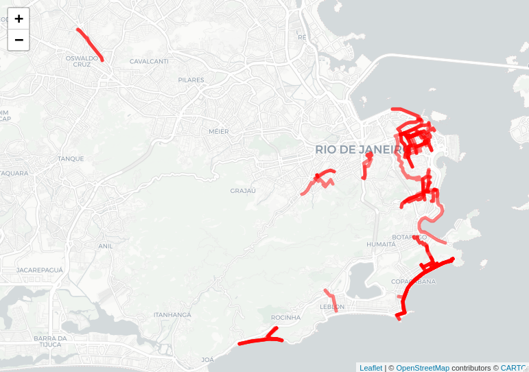

```{r setup, include=FALSE}
knitr::opts_chunk$set(echo = FALSE, warning = FALSE, error = FALSE, message = FALSE, out.width = "100%", fig.pos = "H", out.extra = "")
library(knitr)
library(dplyr)
library(readr)
library(sf)
library(kableExtra)
library(mapview)
library(leaflet)
library(data.table)
```

<!-- - Separar padrão de deslocamento dias de semana e fins de semana e separar isso por área de planejamento -->
<!-- - Traçar um perfil dos usuários dias de semana e fins de semana por área de planejamento -->
<!-- - Diferenciar as vias usadas por tipo de usuário, tem uma forma de identificar os entregadores que podemos pegar com a Tembic -->

Esse documento apresenta a metodologia e resultados do projeto em parceria com a Secretaria Municipal de Transportes do Rio de Janeiro (SMTR). 

# Metodologia

Metodologia.

## Dados utilizados

- **Matriz origem-destino de viagens por bikesharing (Setembro/2021)**: representa todas as viagens relizadas no sistema no mês de Setembro/2021. É o segundo mês com maior quantidade de viagens registradas, ficando atrás somente do mẽs de Janeiro/2020, que não foi escolhido por representar um período atípico (férias etc).  

- **Malha cicloviária atual e planejada**: coletados junto a SMTR.

## Cálculo da matriz de rotas e tempo de viagem entre os pares de estação

A partir da matriz OD foram extraídas todas as estações do sistema. A ferramenta de roteamento `r5r` foi utilizada para o cálculo da matriz de rotas e tempos de viagem de todas as estações para as demais. Nem sempre foi possível encontrar uma rota entre certas estações, e isso acontece principalmente pelo limite de tempo de viagem estabelecido (2h) e por conta da configuração do roteamento que limita a utilização de vias primárias e secundárias para viagens de bicicleta.

Parâmetros que foram adotados no roteamento:
- Velocidade por bicicleta: 12 km/h
- Tempo máximo de viagem: 2h
- Máximo nível de stress do ciclista: 2 (LTS)

## Agrupamento das viagens por pares OD e junção com as rotas

Os dados da matriz OD de viagens são agrupados para cada par origem destino, e a quantidade de viagens entre cada par é calculada separadamente para viagens de semana e final de semana.  Além disso, cada par OD agregado agora tem a rota estimada que foi calculada no roteamento.

## Interseção das rotas com segmentos do OSM

Para permitir análises mais desagradas no viário, os dados agrupados de viagem por rota são desagregados para cada segmento de via a partir uma interseção espacial com os dados de segmento do OSM. O dado resultante agora mostra o carregamento (viagens) em cada um dos segmentos da rede, sem fazer distinção se a viagem é de ida ou volta.

## Identificação de vazios de infraestrutura

A base de segmentos da etapa anterior é então comparada com infraestrutura atual e planejada, buscando avaliar regiões e segmentos com um alto fluxo de viagens que não sejam servidos de uma infraestrutura cicloviária dedicada. O dado resultante é um filtro que mostra os maiores vazios de infraestrutura cicloviária a partir da quantidade de viagens. 

# Resultados

## Localização das estações

```{r figura_estacoes}

```

## Rotas com maior carregamento

### Viagens de semana

```{r table_od_top_weekday}
fread("../../data/smtr_malha_cicloviaria/trips_per_route_weekdays.csv") %>%
  slice(1:10) %>%
  kable(format = "latex", booktabs = T) %>%
  kable_styling(latex_options = c("striped"))

```


```{r figura_od_top_weekday}

```

### Viagens final de semana

```{r table_od_top_weekend}
fread("../../data/smtr_malha_cicloviaria/trips_per_route_weekend.csv") %>%
  slice(1:10) %>%
  kable(format = "latex", booktabs = T) %>%
  kable_styling(latex_options = c("striped"))

```

```{r figura_od_top_weekend}

```

## Trechos com maior carregamento

Viagens de semana

Viagens final de semana

## Trechos com vazio de infraestrutura - rede atual

Viagens de semana

Viagens final de semana

## Trechos com vazio de infraestrutura - rede planejada

Viagens de semana

Viagens final de semana